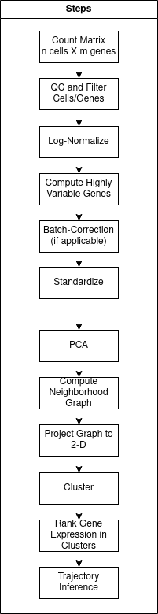

# scRNA-Seq  
## Description  
Analyze the count (expression) matrix produced from single-cell RNA-Seq experiments using <a href="https://scanpy.readthedocs.io/en/stable/">Scanpy.</a>    

## Usage  
### Setup  
Install <a href="https://www.anaconda.com/">Anaconda</a> or <a href="https://docs.conda.io/en/latest/miniconda.html">Miniconda</a>  

Try to create a new environment from the provided environment file (will likely not work cross-platform).  
> conda env create --file=myenvironment.yaml  

Otherwise, install all the required packages:  
> conda install -c conda-forge pandas numpy scikit-learn seaborn spyder  
> conda install -c conda-forge scanpy python-igraph leidenalg louvain fa2  
> conda install -c anaconda jupyter  
> pip install PhenoGraph <a href="https://github.com/dpeerlab/Palantir/">palantir</a>  

### Run script  
From the environment with the installed packages, either open the .py file in <a href="https://www.spyder-ide.org/">Spyder</a> (IDE for Python)  
> spyder  

or run a <a href="https://jupyter.org/">Jupyter Notebook</a> (browser interface to Python) and open the .ipynb file  
> jupyter notebook
___
### Pipeline  
  
